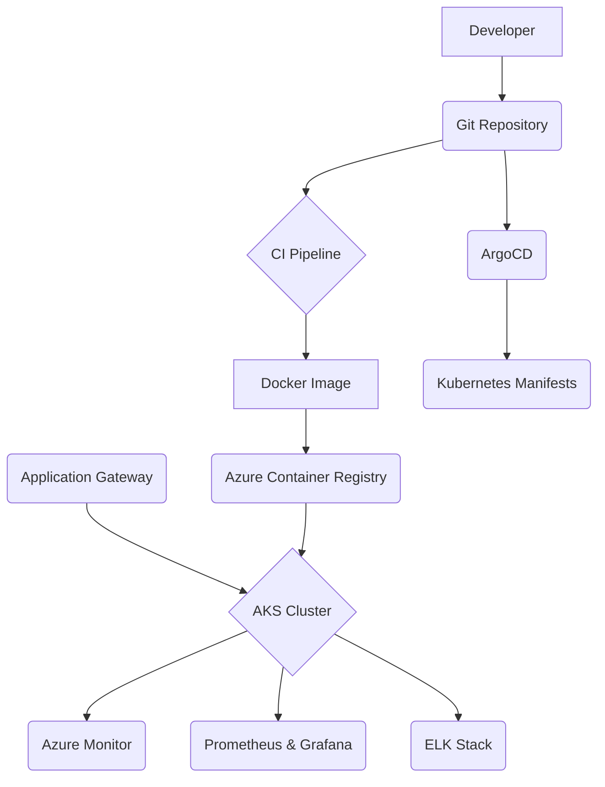

# Architecture Diagram

## Diagram Legend

- **Developer Workflow**: Represents the developer's interaction with the source code repository.
- **CI/CD Pipeline**: Automated process for building, testing, and packaging the application.
- **GitOps**: Continuous deployment mechanism using ArgoCD.
- **Azure Cloud Environment**: The cloud infrastructure hosting the application.
- **Azure VNet**: Isolated network for the application.
- **AKS Cluster**: The Kubernetes cluster where the microservices are deployed.
- **Monitoring & Logging**: Tools for observing the application's health and performance.
